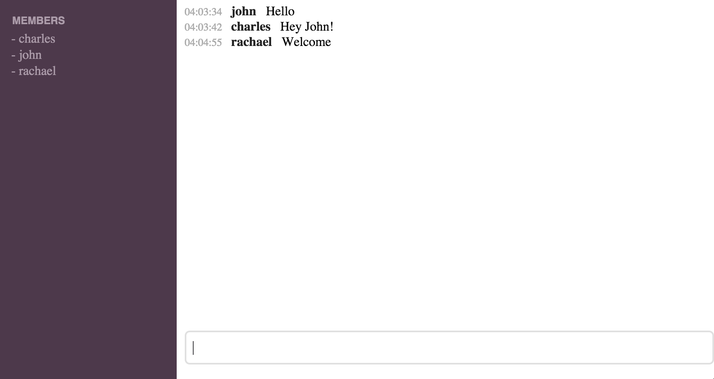

# Haskell in Haste

A (very) short workshop designed to introduce Haskell quickly but practically.

## Getting Started

1. [Download Stack](https://github.com/commercialhaskell/stack/blob/master/doc/install_and_upgrade.md) for your operating system
2. Clone this repository

         git clone https://github.com/charleso/haskell-in-haste.git

3. Run `stack setup` in the root of the directory
4. Run `stack test` in the root of the directory (ignore the test failures)

## Running

1. Run `stack ghci`
2. Type `start` to start app
3. Go to: http://localhost:8080

## To reload files

1. Hit `ctrl-c` to stop app
2. Enter `:r` or `:reload` to recompile the project
3. Type `start` to start app again

## Testing

1. Type `tests` to run them all
2. Type `test "guess"` for matching test(s) names

## Introduction

See [here](doc/README.md) for the material to be used for teaching (very) basic Haskell.

Some concepts are intentionally not being covered due to the time available, which are listed [here](Avoid.md)

## Practical

It's _really_ important to remember that learning a new language can be tricky,
and Haskell especially so. Pick something really simple to start with and
don't feel bad or frustrated if you don't finish.
There should be plenty of mentors floating around, don't hesitate to ask for help.

## Challenges

A number of "bots" have been partially implemented as part of the chat program.
These are grouped in to three rough levels of difficulty.

To state the obvious, but it's recommend that they are tackled in this order.
Once you feel comfortable, or perhaps you're getting bored, try moving to the next level.

### Easy

- [Guessing game](src/Chat/Bot/Guess.hs)

### Medium

- [Word count](src/Chat/Bot/WordCount.hs)
- [Rotational cipher](src/Chat/Bot/Cipher.hs)

### Hard

- [TicTacToe](src/Chat/Bot/TicTacToe.hs)
- [Calculator](src/Chat/Bot/Calculator.hs)

## Answers

Full solutions can be found in the [Chat.Bot.Answer](src/Chat/Bot/Answer/) module.

Answers can be enabled for testing/running:

    > ANSWERS_ENABLED=true stack ghci

## Further Reading

The best place to start is probably the Yorgey lectures.
Both the online material and talks given by the BFPG group
can be found here:

- https://github.com/bfpg/cis194-yorgey-lectures
